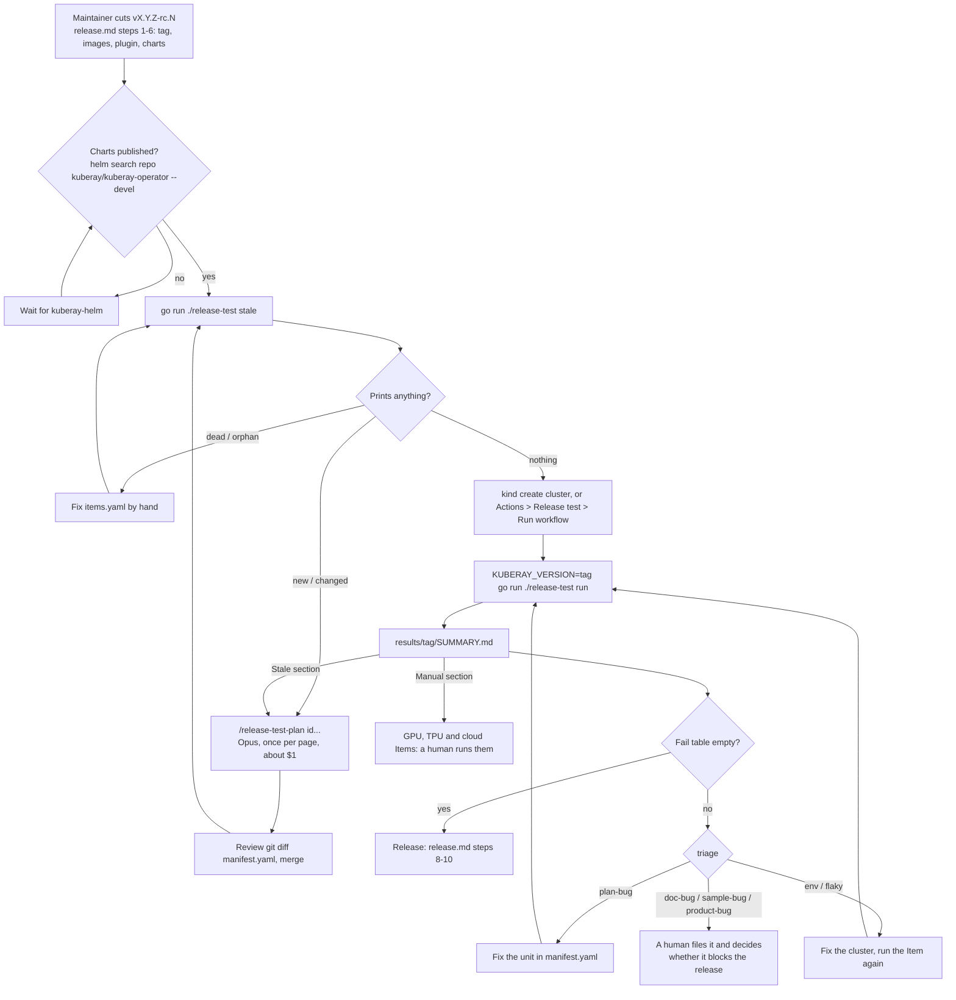
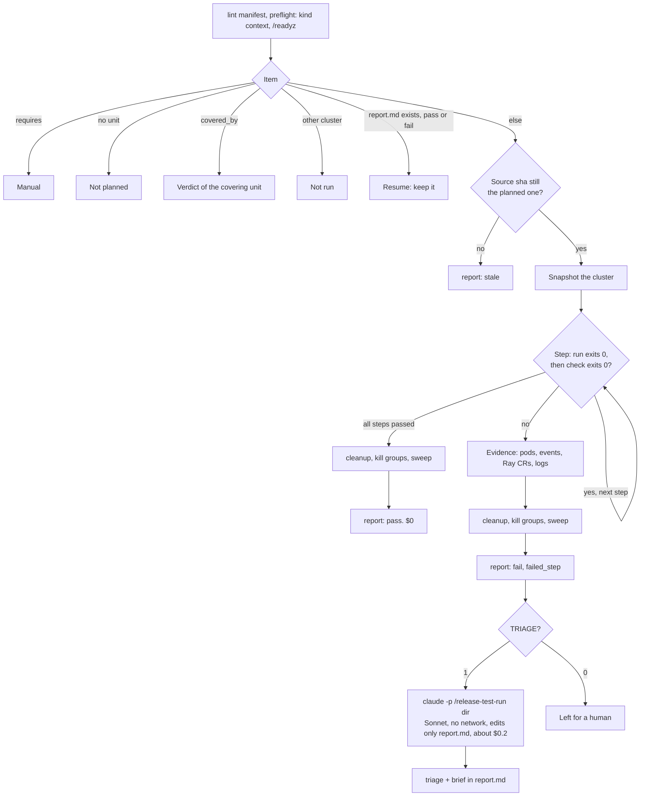

# Release test

Validates a KubeRay release candidate against the docs on docs.ray.io, the samples in
`ray-operator/config/samples/`, the Helm charts and the Go modules, on a local kind cluster. It replaces
the release validation spreadsheet.

An LLM does only two jobs: it turns a doc page into shell steps once (plan), and it explains a failure
(triage). Everything else, including running the steps and deciding pass or fail, is a Go program in this
directory, so a passing Item costs no tokens.

## Files

| File | Written by | Committed |
|---|---|---|
| `items.yaml` | humans: what to validate | yes |
| `manifest.yaml` | the `release-test-plan` skill, reviewed like code: how to validate each Item | yes |
| `*.go` | the program: `go run ./release-test stale \| lint \| run \| summary` | yes |
| `results/<tag>/` | `go run ./release-test run` | no |

The skills are in `.claude/skills/release-test*`: `release-test` drives a whole run, `release-test-plan`
writes manifest units, `release-test-run` triages one failure.

## Flow

From the tag to the verdict. Humans act at the diamonds; the only LLM calls are the plan and the triage.



Inside `run`, per Item:



## Running a release

You need Go, kind, kubectl, helm and git; for plan and triage, the `claude` CLI; and
[yq v4](https://github.com/mikefarah/yq) and [uv](https://github.com/astral-sh/uv), which some planned steps
use. Run the commands from the repository root.

| Command | Does |
|---|---|
| `go run ./release-test stale [ID...]` | lists Items whose unit is missing or whose source changed since it was planned |
| `go run ./release-test lint` | checks `manifest.yaml` |
| `go run ./release-test run [ID...]` | runs the manifest, writes the results, calls triage on failures |
| `go run ./release-test summary` | builds `results/<tag>/SUMMARY.md` from the reports' front matter |

1. Plan what changed. `go run ./release-test stale` lists the Items with no unit yet, or whose page or sample
   changed since their unit was written; ask Claude to plan them (`/release-test-plan`), then review
   `git diff release-test/manifest.yaml` and commit it. Units whose source did not change are not
   touched, so this is usually a handful of Items per release.
2. Run.

   ```sh
   kind create cluster --name release-test
   KUBERAY_VERSION=v1.8.0-rc.0 go run ./release-test run
   ```

   It takes hours and resumes where it stopped. `go run ./release-test run ID...` re-runs single Items.
   Before running, it checks that the tag's charts are published and, the way `stale` does, that every
   unit's source is still the one it was planned from: a unit whose page changed is not run but listed
   under Stale, because its steps would test an older page. It stops when three units in a row fail at
   their first step, since that is the environment, not the release. Ctrl-C runs the current unit's
   cleanup and stops; that unit has no report and runs again next time.
3. Read `results/<tag>/SUMMARY.md`: the Fail table has the failed step, the triage class and a one-line
   brief for each failed Item.
4. Open `results/<tag>/<id>/report.md` for a failure: the step table, the Triage section with the
   decisive log lines and the suggested fix, and links to `steps/NN.log`. Ask Claude to look further, or
   to apply a `plan-bug` fix to the manifest and re-run the Item.

`/release-test v1.8.0-rc.0` in Claude Code does the same steps for you.

### In GitHub Actions

The `Release test` workflow (`.github/workflows/release-test.yaml`) does steps 2 and 3 on a GitHub-hosted
runner: trigger it from the Actions tab with the tag once the Helm charts are published. It puts
`SUMMARY.md` in the job summary and uploads `results/` as an artifact. Note that `workflow_dispatch` only
offers workflows that exist on the default branch.

Triage in the workflow needs the `ANTHROPIC_API_KEY` repository secret, a key from the Anthropic Console.
The triage call has no shell and no network, reads only this repository and the results directory, and can
edit only the unit's `report.md`, because it reads Pod logs nobody vetted.
Without it the workflow sets `TRIAGE=0`: it still runs everything and uploads the results, and whoever
needs a failure explained downloads the artifact and runs
`claude -p "/release-test-run <results dir>"` with their own login. Locally no key is needed: the runner
calls `claude`, which uses the Claude Code login on the machine. An `ANTHROPIC_API_KEY` in the environment
takes precedence over that login and bills the API account instead. Steps never see these variables, only
the triage call does.

## items.yaml

```yaml
- id: raycluster-quick-start           # stable slug; the unit id and results/<id>/
  source: https://docs.ray.io/en/master/kuberay/getting-started/raycluster-quick-start.html
- id: ray-cluster-sample
  source: ray-operator/config/samples/ray-cluster.sample.yaml
- id: ray-cluster-tpu-v6e-singlehost
  source: ray-operator/config/samples/ray-cluster.tpu-v6e-singlehost.yaml
  requires: [tpu, gke]                 # not runnable on kind: listed under Manual, never planned or run
- id: go-get-ray-operator
  procedure: |                         # for Items that are neither a page nor a sample
    In an empty Go module, go get github.com/ray-project/kuberay/ray-operator@$KUBERAY_VERSION succeeds ...
```

`requires` is how an Item says it needs a GPU, a TPU or a cloud. Declaring it here means nobody spends
tokens finding that out.

## manifest.yaml

Each step is a `run` command and a `check` command; the step passes when both exit 0. Commands use
`$KUBERAY_VERSION` and `$CHART_VERSION`, never a fixed version, so the file carries over to the next
release. `source_sha` is the git blob sha of the page's markdown (or the sample, or the procedure text)
when the unit was planned; `stale` compares it with today's. `lint` checks the file, also for unknown keys
(a misspelled `chek:` would otherwise check nothing), and `run` runs the lint first. See
`.claude/skills/release-test-plan/SKILL.md` for the format.

## Results

```text
results/<tag>/
├── SUMMARY.md
└── <item-id>/
    ├── report.md        front matter (item, status, version, failed_step, triage, brief) + step table;
    │                    status is pass, fail or stale (the source changed since the unit was planned);
    │                    an interrupted unit has no report
    ├── steps/NN.log     the command, the check, the output, the exit code
    ├── steps/cleanup.log
    ├── evidence/        on failure: pods, events, Ray resources, describe, Pod logs
    └── triage.json      on failure: the triage call's result and cost
```

`triage` is one of `plan-bug` (our manifest is wrong), `doc-bug`, `sample-bug`, `product-bug`, `env` (the
local cluster cannot do it) or `flaky`. Nothing files GitHub issues; a human decides.

## Cost

Planning one page took about 3 minutes and $1 with Opus, once per page and again only when the page
changes. Triage of one failure took about 30 seconds and $0.16 with Sonnet (`TRIAGE_MODEL` to change;
`TRIAGE=0` to skip). A passing Item costs nothing.
